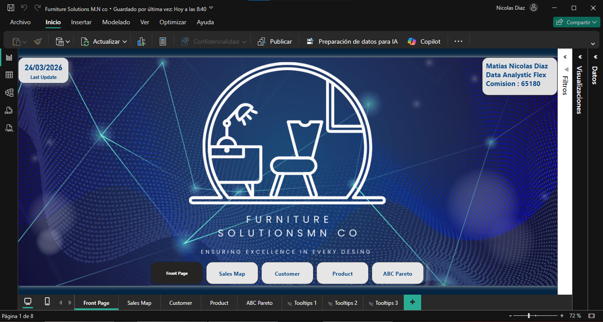
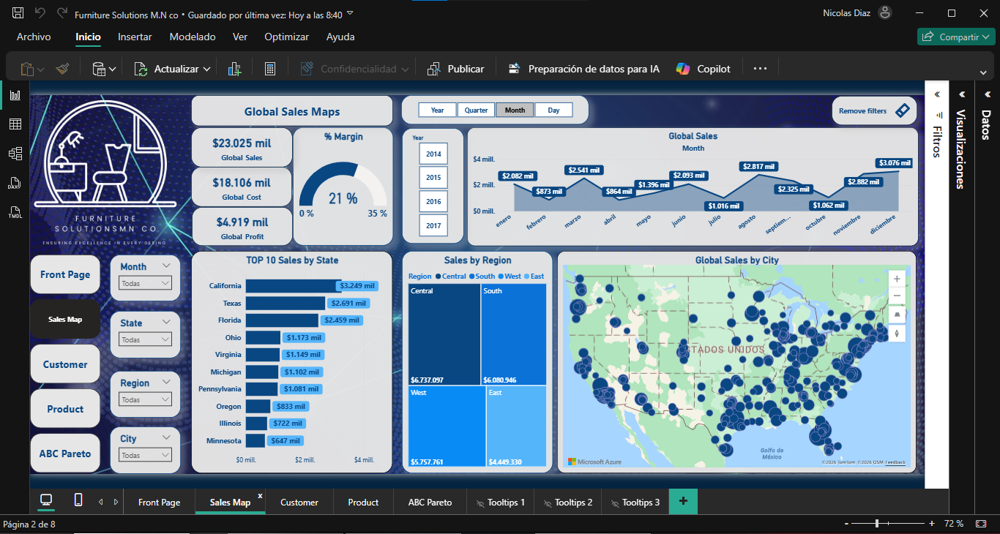
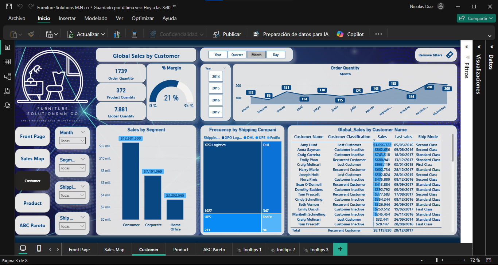
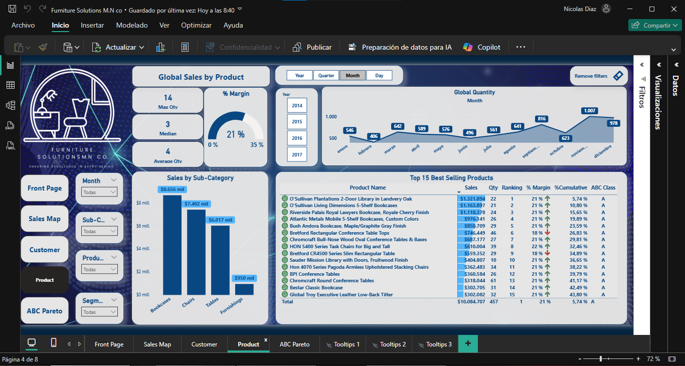
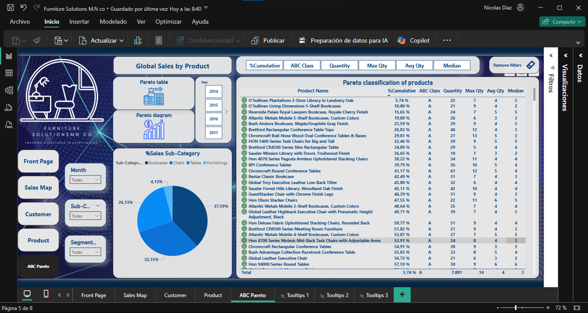
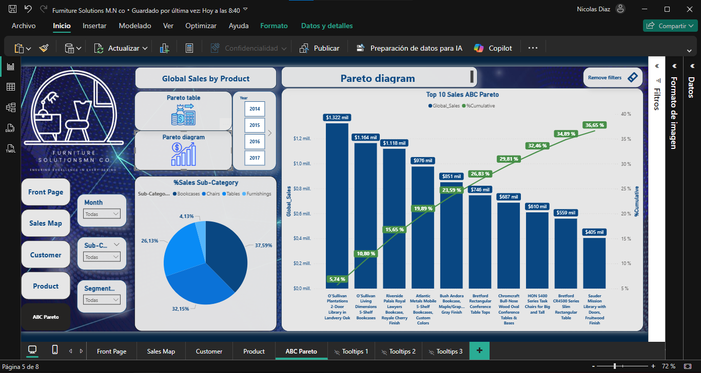

# 🪑 Furniture Solutions MN Co — Sales Analysis Dashboard

<p align="center">
  
</p>

<p align="center">
  
  
  
  
  
</p>

---

## 📌 Descripción del Proyecto

Análisis integral del historial de ventas (2014–2017) de **Furniture Solutions MN Co**, una empresa minorista de muebles de Estados Unidos. El proyecto combina un dashboard interactivo en Power BI con un análisis exploratorio en Python, cubriendo desde la limpieza de datos hasta modelos predictivos y clasificación ABC Pareto.

> **Objetivo:** Identificar patrones de ventas, clasificar productos por demanda, segmentar clientes y optimizar estrategias de inventario.

---

## 📊 Dataset

| Campo | Detalle |
|-------|---------|
| **Fuente** | [Kaggle - Store Sales Forecasting](https://www.kaggle.com/datasets/tanayatipre/store-sales-forecasting-dataset) |
| **Período** | 2014 – 2017 |
| **Registros** | +9.000 transacciones |
| **Cobertura** | Estados Unidos |
| **Licencia** | Apache License 2.0 |

---

## 🗂️ Estructura del Repositorio

```
Furniture-Solutions-PowerBI/
│
├── README.md
├── Furniture_Solutions_M_N_co.pbix       ← Dashboard interactivo Power BI
├── stores_sales_forecasting.xlsx         ← Dataset fuente
├── DS1_Matias_Nicolas_Diaz.ipynb         ← Análisis exploratorio en Python
│
├── docs/
│   ├── Documentacion_Furniture_Solutions.pdf   ← Documentación técnica completa
│   └── Storytelling.pdf                        ← Presentación de resultados
│
└── img/
    └── dashboard_preview.png             ← Captura del dashboard
```

---

## 🔍 Preguntas de Negocio Respondidas

- ¿Cuáles son los productos más vendidos y rentables?
- ¿Qué productos representan el 80% de las ventas? (Análisis ABC Pareto)
- ¿Cómo varía la demanda según los meses y el año?
- ¿Cuáles son los clientes más valiosos y cómo retenerlos?
- ¿Cuál es la demora promedio entre orden y envío?
- ¿Qué regiones y estados tienen mayor actividad?

---

## 📈 Resultados Clave

| Métrica | Valor |
|---------|-------|
| 💰 Ventas Totales (2014–2017) | **$23.025 millones** |
| 💸 Costo Total | **$18.106 millones** |
| 📦 Ganancia Total | **$4.919 millones** |
| 📊 Margen de Ganancia | **21%** |
| 👥 Órdenes Totales | **1.739** |
| 🏆 Top Región | **Central — $6.737M** |

### 🏆 Top 5 Productos Más Vendidos

| Ranking | Producto | Ventas |
|---------|----------|--------|
| 1 | O'Sullivan Plantations 2-Door Library in Landvery Oak | $1.321.894 |
| 2 | O'Sullivan Living Dimensions 5-Shelf Bookcases | $1.163.897 |
| 3 | Riverside Palais Royal Lawyers Bookcase, Royale Cherry Finish | $1.118.378 |
| 4 | Atlantic Metals Mobile 5-Shelf Bookcases, Custom Colors | $976.141 |
| 5 | Bush Andora Bookcase, Maple/Graphite Gray Finish | $859.709 |

---

## 🗺️ Dashboard Power BI — Páginas

| Página | Descripción |
|--------|-------------|
| **Front Page** | Portada con navegación y fecha de actualización |
| **Sales Map** | Ventas por región, estado y ciudad con mapa interactivo |
| **Customer** | Segmentación y clasificación de clientes (Recurrente / Inactivo / Perdido) |
| **Product** | Análisis por categoría y sub-categoría con ranking |
| **ABC Pareto** | Clasificación ABC de productos según el principio de Pareto |

### Portada


### Sales Map


### Customer


### Product


### ABC Pareto



---

## 🧮 Modelo de Datos (Power BI)

El modelo sigue un esquema **estrella** con las siguientes tablas:

```
Sales Table (tabla de hechos)
    ├── Order Table      (fecha orden, envío, modo)
    ├── Customer Table   (cliente, segmento)
    │       └── Address Table (país, ciudad, región)
    ├── Product Table    (producto, sub-categoría)
    ├── Calendar         (tabla de fechas)
    └── Measures Table   (medidas DAX calculadas)
```

---

## 📐 Medidas DAX Principales

```dax
-- Ventas Globales
Global_Sales = SUM('Sales Table'[Total Sales])

-- Margen de Ganancia
% Margin = DIVIDE([Global_Profit], [Global_Sales], 0)

-- Clasificación ABC
ABC Classification =
IF([%Cumulative] >= 0.9, "C",
IF([%Cumulative] <= 0.80, "A", "B"))

-- Clasificación de Cliente
Customer Classification =
VAR _Days = DATEDIFF([Last sales], DATE(2017,12,31), DAY)
RETURN
IF(_Days < 180, "Recurrent Customer",
IF(_Days <= 540, "Customer Inactive", "Lost Customer"))
```

---

## 🐍 Análisis en Python (Notebook)

El notebook cubre las siguientes etapas:

1. **Carga y exploración** — pandas, shape, info, describe
2. **Limpieza de datos** — tipos, duplicados, valores nulos
3. **Visualizaciones** — matplotlib, seaborn (líneas, tortas, histogramas, heatmap)
4. **Detección de Outliers** — IQR y Z-Score
5. **Regresión Lineal Simple** — Cost → Sales (sklearn)
6. **Regresión Lineal Múltiple** — Cost + Profit → Sales
7. **Regresión Polinómica** — grado 2
8. **Series de Tiempo** — modelo ARIMA/SARIMA/Prophet

```python
# Ejemplo: Clasificación de Outliers con Z-Score
from scipy import stats
df['z_score'] = stats.zscore(df['Sales'])
df_cleaned = df[df['z_score'].abs() <= 1.5]

# Regresión Lineal
from sklearn.linear_model import LinearRegression
lin_reg = LinearRegression()
lin_reg.fit(x_train, y_train)
r2 = lin_reg.score(x_test, y_test)
```

---

## 🛠️ Tecnologías Utilizadas

- **Power BI Desktop** — Dashboard interactivo
- **DAX** — Medidas calculadas
- **Power Query (M)** — Transformación de datos
- **Python 3** — Análisis exploratorio
- **pandas / numpy** — Manipulación de datos
- **matplotlib / seaborn** — Visualizaciones
- **scikit-learn** — Modelos de ML
- **statsmodels** — Series de tiempo ARIMA
- **Google Colab** — Entorno de ejecución

---

## 🚀 Cómo usar el Dashboard

1. Descargá el archivo `Furniture_Solutions_M_N_co.pbix`
2. Abrilo con **Power BI Desktop** (gratis en [microsoft.com](https://powerbi.microsoft.com/desktop))
3. El dataset está embebido — no necesitás configurar nada
4. Navegá entre las páginas usando los botones de la portada

---

## 📄 Documentación

- 📘 [Documentación Técnica Completa](docs/Documentacion%20Furniture%20Solutions%20M.N%20co%20Entrega%20Final.pdf) — Modelo de datos, transformaciones, medidas DAX
- 📊 [Storytelling](docs/Storytelling.pdf) — Presentación de resultados con visualizaciones

---

## 🔗 Links

- 📁 [Repositorio GitHub](https://github.com/nicodiax22/Porfolio_Power_Bi)
- 🎥 [Video demo del dashboard](https://youtu.be/EfBjv97g8OE)
- 💼 [LinkedIn](https://www.linkedin.com/in/nicolas-diaz-641a17346)

---

## 👤 Autor

**Matías Nicolás Díaz**
Data Analytics Flex — Coderhouse
📅 Octubre 2024
💼 [linkedin.com/in/nicolas-diaz-641a17346](https://www.linkedin.com/in/nicolas-diaz-641a17346)

---

## 📜 Licencia del Dataset

Dataset bajo [Apache License 2.0](https://www.apache.org/licenses/LICENSE-2.0)
Copyright [2024] Tanaya Tipre
